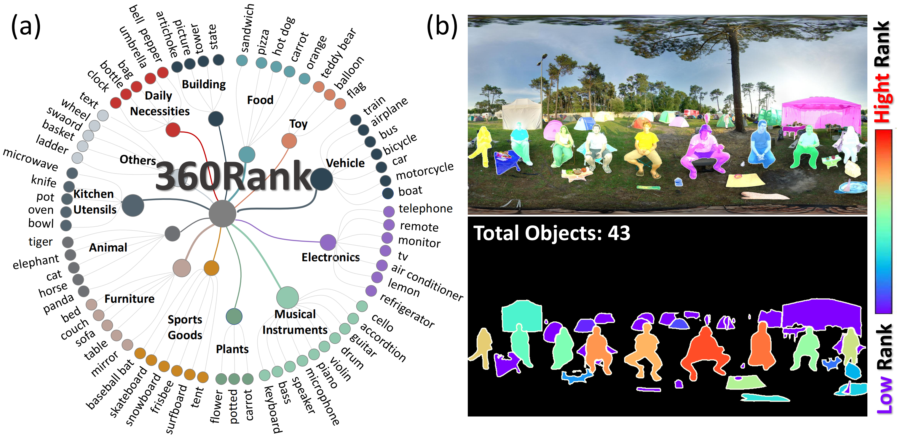
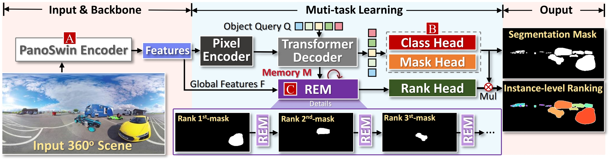
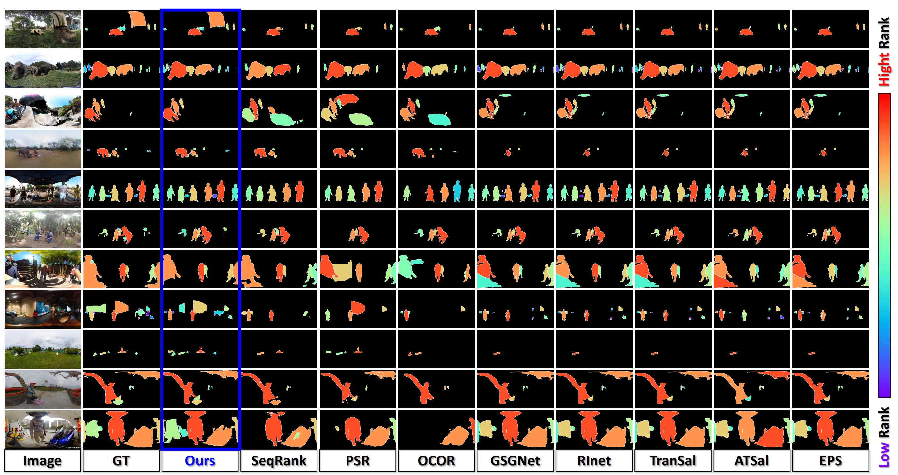

# FOIR-360 Task
# Prerequisites
The training and testing experiments are conducted using PyTorch 1.10.0 with a single GeForce RTX 3090 GPU with 24GB Memory.
* Windows
* CUDA v11.1, cudnn v.7.5.0
* PyTorch 1.10.0
* Torchvision

# Annotation Tools
 We developed an instance-level ranking annotation protocol to assist volunteers in the annotation process. The specific tools are located in the Annotation Tool folder, and detailed usage instructions can be found in the txt file.
 Our annotation tool is simple and intuitive, enhancing both annotation efficiency and accuracy. The interface is primarily implemented with PyQt5. Simply click on **Tool.exe** to start annotating. You can replace any image and segmentation mask you wish to annotate.

# 360Rank Dataset

This repository provides the 360Rank dataset.
360Rank is a importance object ranking dataset of 500 images

### Example

## Download Dataset
360Rank database can be downloaded from [BiaduPan:https://pan.baidu.com/s/1uZMRJR77ekIXTe14316xPQ?pwd=rqi7](key:rqi7 ).

# Our Weak-Supervision Method
Step 1. `Local View Rank Computation.` --> Step 2. `Iteratively Erase the Object with the Highest Rank.` --> Step 3. `Local Rank Collector.`

# PanoRank network

# Evaluation of Our Method

## TODO List
- [x] release the dataset [part1]
- [ ] release the dataset [part2]
- [ ] release the usuage code
